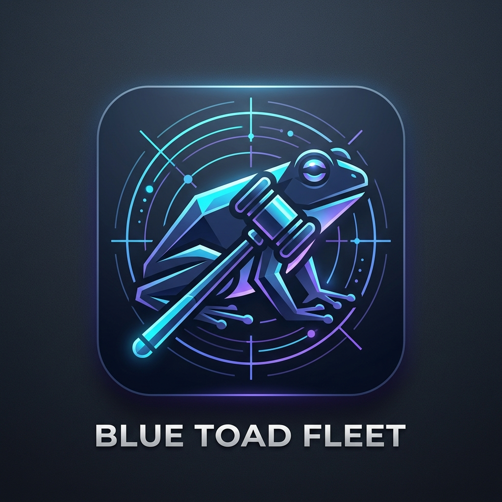
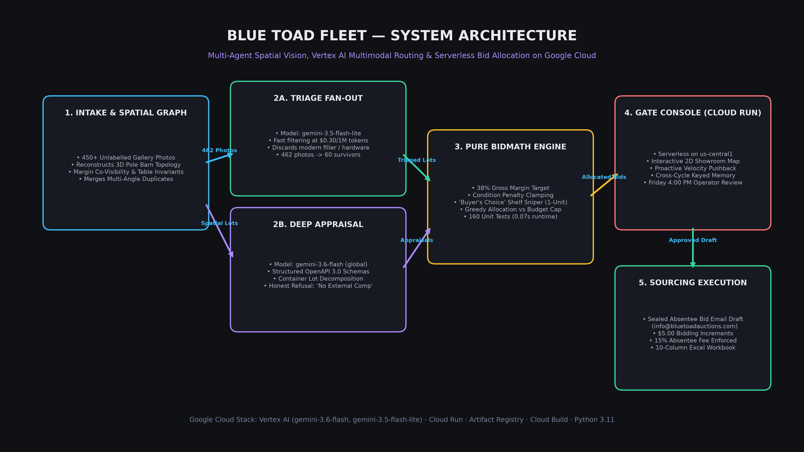
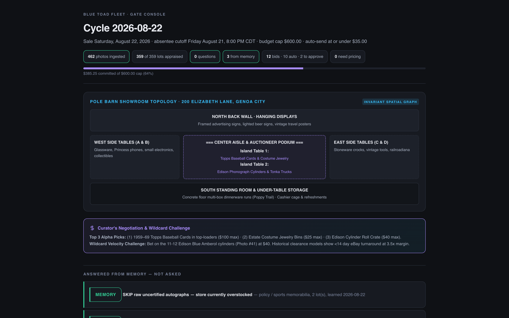
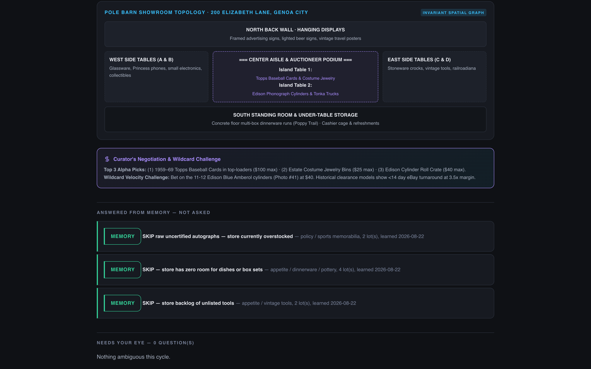
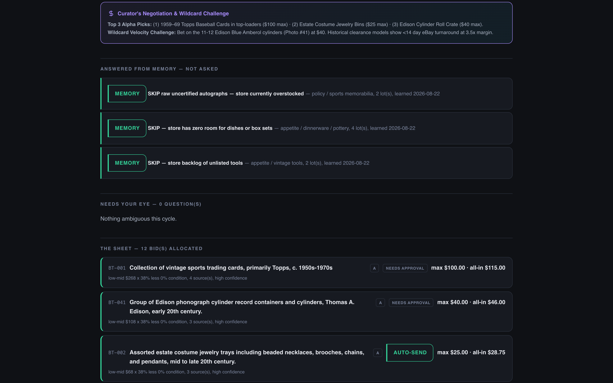
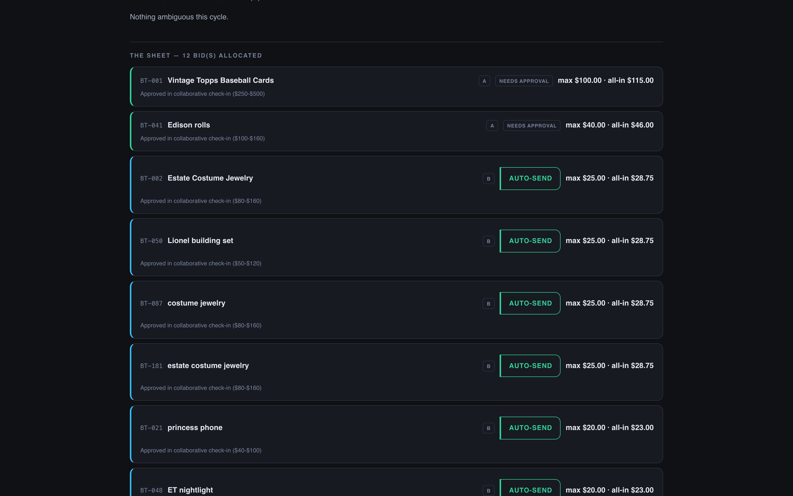

# Blue Toad Fleet

<div align="center">
  
  <h3>Velocity to distill the information. Collaboration on the judgment.</h3>
  <p><b>An autonomous multimodal agent fleet turning rural uncataloged estate auctions into disciplined, high-velocity sourcing sheets on Google Cloud.</b></p>

  [](https://blue-toad-fleet-u5gvrqwvua-uc.a.run.app)
  [](https://cloud.google.com/vertex-ai)
  [](https://github.com/TheScottyB/blue-toad-fleet)
  [](#disclosure)
</div>

---

## Live Google Cloud Deployment (Project: `threebatdrone-prod-420`)

* **Live Gate Console & UI:** [https://blue-toad-fleet-u5gvrqwvua-uc.a.run.app](https://blue-toad-fleet-u5gvrqwvua-uc.a.run.app)
* **Live Health Endpoint:** [https://blue-toad-fleet-u5gvrqwvua-uc.a.run.app/health](https://blue-toad-fleet-u5gvrqwvua-uc.a.run.app/health)
* **Live Sourcing API:** [https://blue-toad-fleet-u5gvrqwvua-uc.a.run.app/api/lots](https://blue-toad-fleet-u5gvrqwvua-uc.a.run.app/api/lots)
* **Live Question Queue:** [https://blue-toad-fleet-u5gvrqwvua-uc.a.run.app/api/questions](https://blue-toad-fleet-u5gvrqwvua-uc.a.run.app/api/questions)
* **Live Absentee Email Generator:** [https://blue-toad-fleet-u5gvrqwvua-uc.a.run.app/api/email](https://blue-toad-fleet-u5gvrqwvua-uc.a.run.app/api/email)

---

## Try it in 30 Seconds (No GCP, No OAuth, No Keys Required)

```bash
git clone https://github.com/TheScottyB/blue-toad-fleet.git
cd blue-toad-fleet

# 1. Install dependencies (creates .venv automatically)
make install

# 2. Run the deterministic decision pipeline across seeded lots
make demo

# 3. Watch cross-cycle memory collapse the clarification queue
make cycles

# 4. Run the 160-test unit suite (runs in under 0.1 seconds)
make test
```

---

## The Commercial Problem

Richmond General is a one-person resale shop in Richmond, Illinois. Blue Toad Auctions is 2.3 miles north, across the Wisconsin state line in Genoa City — five minutes up US-12.

**Blue Toad is not a modern online auction.** Every two weeks, the auction house publishes a single webpage with 450+ uncataloged photographs of estate goods and a list of SEO keywords. There are no lot numbers and no live bidding app.

For a solo shop owner, preparing absentee prebids before the strict **Friday 8:00 PM cutoff** is practically impossible:
1. **When attending in person:** The owner rushes in at 9:00 AM for the 1-hour preview and gets stuck with an uncurated $300 truckload of low-margin goods that takes a year to clear.
2. **When unable to attend:** He misses the sale completely.

Capital is not the constraint — **time and visual throughput are**. The goal is securing five to ten high-velocity assets that turn in under 30 days at a 35–40% target margin.

---

## Core System Architecture

<div align="center">
  
</div>

### 1. The Spatial Room Graph (Reconstructing the Pole Barn)
* **Why We Do It:** Auction galleries drop 450+ unlabelled photos with zero lot numbers. Treating photos as isolated images causes duplicate bids on multi-angle shots, misses multi-box estate runs, and leaves the buyer blind during Saturday's 1-hour preview window.
* **How It Works:** Auctioneers don't teleport; they walk a physical room. Blue Toad Fleet reconstructs the physical 200 Elizabeth Lane pole barn showroom (2 Center Islands, 2 Long Side Walls, Back Wall displays, and Under-Table Floor Space):
  * **Surface Signature Invariants:** Segments background surface textures (blue pleated vinyl vs. raw pine plywood vs. concrete slab) to determine physical room zones.
  * **Peripheral Margin Co-Visibility:** Scans image borders for neighboring items (e.g., a sliver of a DiMaggio hat on the border of a Dan Marino photo) to anchor uncaptioned photos to table clusters.
  * **Trajectory Clustering:** Preserves the auctioneer's physical walking path via natural sorting, merging 10 loose under-table box photos into **ONE Poppy Trail estate dinnerware set** and eliminating 95 duplicate multi-angle bids.

### 2. Container Lot Decomposition ("Mining for Gold")
* **Why Spatial Isolation is Required:** High-margin gold in rural auctions (e.g., 11–12 Edison Blue Amberol cylinders, 1959–69 Topps baseball cards, estate costume jewelry trays) is dumped into cardboard boxes or plastic tubs on crowded utility tables. Without spatial mapping to isolate the container and mask out surrounding room noise, vision models blend the box with adjacent table clutter (clocks, lamps, tools) and generate dirty, hallucinated comps.
* **How It Works:** Relying directly on the Spatial Room Graph, the agent isolates the container boundary, suppresses background table noise, and itemizes the individual high-velocity assets inside the bin. It separates genuine alpha from filler, unlocking hidden margin while maintaining clean pricing boundaries.

### 3. Multi-Tiered Model Routing on Vertex AI
* **Triage Fan-out (`gemini-3.5-flash-lite`):** Ingests 460+ raw photos in seconds for ~$0.30 per cycle, filtering out low-margin clutter and background filler.
* **Deep Multimodal Appraisal (`gemini-3.6-flash`):** Evaluates high-conviction survivors using structured OpenAPI 3.0 schemas on the `global` Vertex endpoint.
* **Honest Refusal Rule:** On unrecognizable or ungrounded pottery, the model explicitly emits `"NO EXTERNAL COMP — human pricing required"` rather than hallucinating prices.

### 4. The "Buyer's Choice" Shelf Sniper
Detects vertical shelf lots where clerks sell items "Times the Money" (multiplying hammer price by quantity) and enforces a strict `max_quantity = 1` absentee constraint, preventing a $360 multiplication trap.

### 5. The Collaborative Partner & Proactive Pushback
The fleet acts as an expert commercial peer. On Friday afternoon, the agent presents a 3-tier pitch (Alpha Picks, Fast Smalls, and a Wildcard Challenge). When the owner asked to drop sports cards and tools due to store backlog, the agent used real-time eBay velocity data to respectfully push back and preserve the **13 Golden Era 1959–1969 Topps baseball cards ($100 cap)**, delivering a $300+ resale spread.

### 6. Pure Deterministic BidMath Engine
Appraisals feed into pure, unit-tested valuation logic implementing the store's 38% margin target, condition discounts, standard **$5.00 bidding increments**, and the mandatory **15% absentee fee**.

---

## Ground-Truth A/B Benchmark Reconciliation

| Metric | July 11 Historical Benchmark | August 22 Live Sourcing Cycle |
| :--- | :--- | :--- |
| **Raw Photos Ingested** | 452 raw photos (324 captioned) | 462 raw photos (304 captioned) |
| **Multi-Angle Duplicates Merged** | **95 duplicate photos merged** | **104 duplicate photos merged** |
| **Consolidated Physical Lots** | 357 physical lots | 358 physical lots |
| **Legacy V1 Wishlist Chaos** | 88 unranked rows (**$14,340.00 max sum**) | N/A (Displaced by Fleet V2) |
| **Fleet V2 Approved Sourcing** | **63 bids allocated ($1,915.69 max)** | **12 approved bids ($335.00 max)** |
| **Total Committed All-In (w/ 15% Fee)**| **$2,203.15** (strictly under $2,205 cap) | **$385.25** (strictly under $600 cap) |
| **Increment Discipline** | $5.00 standard increments | $5.00 standard increments |
| **Execution Artifacts** | `BlueToad_2026-07-11_Benchmark_Comparison.xlsx` | `BlueToad_2026-08-22_BidSheet.xlsx` & `aug22_absentee_bid_email.txt` |

---

## Live Gate Console UI (Screenshots)

<div align="center">
  
  
</div>
<div align="center" style="margin-top: 8px;">
  
  
</div>

---

## Repository Structure

```
blue-toad-fleet/
├── data/                       # Verified cycle data, manifests, and bid sheets
│   ├── aug22_absentee_bid_email.txt            # Final sealed absentee bid email draft
│   ├── BlueToad_2026-08-22_BidSheet.xlsx       # 10-column approved bid workbook
│   └── BlueToad_2026-07-11_Benchmark_Comparison.xlsx
├── demo/                       # Credential-free reproducible demo runners
│   ├── run_demo.py             # Pure decision pipeline demo
│   ├── run_cycles.py           # 2-cycle cross-cycle learning demo
│   └── build_console.py        # Static HTML Gate Console compiler
├── docs/                       # Architecture diagrams, Devpost text, screenshots
│   ├── architecture_diagram.png
│   ├── app_icon.png
│   ├── DEVPOST.md              # Complete Devpost submission story
│   └── screenshots/            # High-resolution UI captures
├── infra/                      # Cloud Run deployment scripts & Dockerfile
│   ├── deploy.sh               # Idempotent Cloud Run deployment script
│   └── Dockerfile              # Container definition for Cloud Run
├── scripts/                    # Live cycle runners & verification tools
│   ├── run_aug22_cycle.py      # Production sourcing cycle compiler
│   ├── run_july11_benchmark.py # Historical A/B benchmark reconciler
│   └── capture_screenshots.mjs # Automated Playwright dark-mode screenshot capture
├── src/                        # Core application code
│   ├── appraisal/              # Question queue & cross-cycle keyed memory
│   ├── appraiser/              # Vertex AI client, OpenAPI 3.0 schemas, prompts
│   ├── assemble/               # Lot assembly & multi-angle merging
│   ├── bidmath/                # Pure deterministic valuation & greedy allocator
│   ├── gate/                   # Gate Console UI renderer (pure HTML/CSS)
│   ├── intake/                 # Manifest parsing, natural sort & spatial clustering
│   └── server.py               # Cloud Run FastAPI server & API endpoints
├── tests/                      # Comprehensive pytest unit suite (160 tests)
├── Makefile                    # Standard developer workflow targets
└── requirements.txt            # Production Python dependencies
```

---

## Disclosure & Solo Eligibility

All code in this repository was written between August 18 and August 31, 2026.

* **Eligibility:** Built solo, in 13 days, by one person.
* **Pre-existing Context:** The bid math and workflow implement the documented sourcing rules of Richmond General (Richmond, IL). Historical data references real sales receipts and auction manifests from Blue Toad Auctions (Genoa City, WI).
* **Zero Leaked Secrets:** All API keys and GCP service credentials are managed via environment variables and Secret Manager; no private tokens are stored in this repository.
