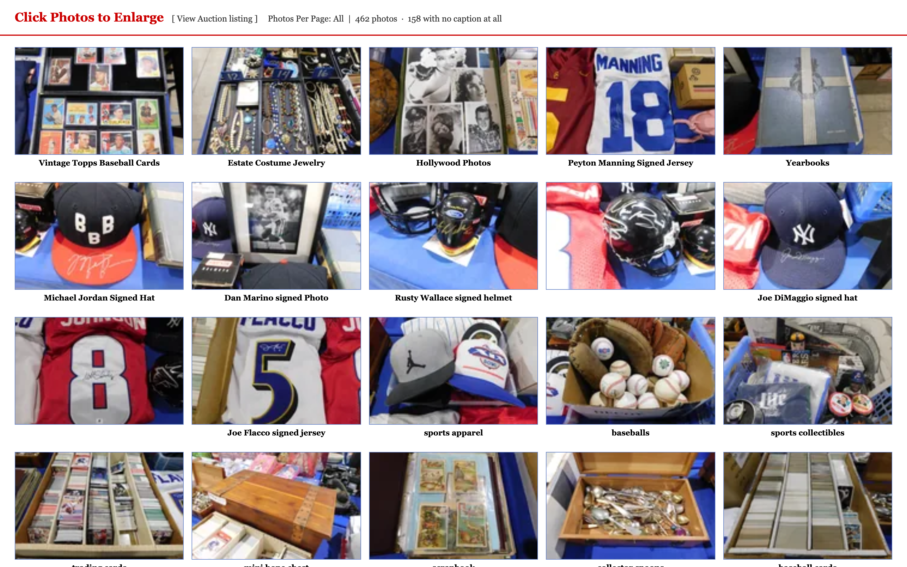

# Blue Toad Fleet

<div align="center">
  
  <h3>Velocity to distill the information. Collaboration on the judgment.</h3>
  <p><b>An autonomous multimodal agent fleet turning rural uncataloged estate auctions into disciplined, high-velocity sourcing sheets on Google Cloud.</b></p>

  [](https://blue-toad-fleet-u5gvrqwvua-uc.a.run.app)
  [](https://cloud.google.com/vertex-ai)
  [](https://github.com/TheScottyB/blue-toad-fleet)
  [](LICENSE)
</div>

---

## Live Google Cloud Deployment (Project: `threebatdrone-prod-420`)

* **Live Gate Console & UI:** [https://blue-toad-fleet-u5gvrqwvua-uc.a.run.app](https://blue-toad-fleet-u5gvrqwvua-uc.a.run.app)
* **Live Health Endpoint:** [https://blue-toad-fleet-u5gvrqwvua-uc.a.run.app/health](https://blue-toad-fleet-u5gvrqwvua-uc.a.run.app/health)
* **Live Sourcing API:** [https://blue-toad-fleet-u5gvrqwvua-uc.a.run.app/api/lots](https://blue-toad-fleet-u5gvrqwvua-uc.a.run.app/api/lots)
* **Live Question Queue:** [https://blue-toad-fleet-u5gvrqwvua-uc.a.run.app/api/questions](https://blue-toad-fleet-u5gvrqwvua-uc.a.run.app/api/questions)
* **Live Absentee Email Generator:** [https://blue-toad-fleet-u5gvrqwvua-uc.a.run.app/api/email](https://blue-toad-fleet-u5gvrqwvua-uc.a.run.app/api/email)

---

## Demo Video

[`media/blue_toad_fleet_demo.mp4`](media/blue_toad_fleet_demo.mp4) — a narrated, 4-beat walkthrough (~3:48) covering the commercial problem, the Spatial Room Graph on the real Aug-22 gallery, the live Gate Console's Curator's Negotiation, and the live Cloud Run / test-suite proof. Recorded end to end from the real manifest, the real deployed console, and a real terminal session — see `docs/VIDEO_SCRIPT.md` for the shot-by-shot script.
Recorded on 2026-08-20, and the figures on screen are that run's: 12 lots, $335.00 max, $385.25 all-in. The sheet has since been trimmed to **9 lots, $275.00 max, $316.25 all-in** — the auctioneer ruled the labelled jewelry-tray run a ×3 bid, and BT-181 turned out to be BT-002 re-photographed (see `NOTES.md` §5). The current figures live in `data/BlueToad_2026-08-22_BidSheet.xlsx` and `data/aug22_absentee_bid_email.txt`. `make demo` runs credential-free seeded lots and is not this cycle's sheet; the deployed Cloud Run service has not been redeployed since the trim.

---

## Try it in 30 Seconds (No GCP, No OAuth, No Keys Required)

```bash
git clone https://github.com/TheScottyB/blue-toad-fleet.git
cd blue-toad-fleet

# 1. Install dependencies (creates .venv automatically)
make install

# 2. Run the deterministic decision pipeline across seeded lots
make demo

# 3. Watch cross-cycle memory collapse the clarification queue
make cycles

# 4. Run the unit suite — 565 pass, 7 network tests skip by default (~5s)
make test
```

---

## The Commercial Problem

Richmond General is a one-person heritage resale shop in Richmond, Illinois (McHenry County). Blue Toad Auctions is located at 200 Elizabeth Lane, Genoa City, Wisconsin (Walworth County), 2.3 miles north via US-12 (5-minute drive / 53-minute walk across the state line).

**Blue Toad is not a modern online auction.** Every two weeks, the auction house publishes a single webpage with 450+ uncataloged photographs of estate goods and a list of SEO keywords. There are no lot numbers and no live bidding app.

For a solo shop owner, preparing absentee prebids before the strict **Friday 8:00 PM cutoff** is practically impossible:
1. **When attending in person:** The owner rushes in at 9:00 AM for the 1-hour preview and gets stuck with an uncurated $300 truckload of low-margin goods that takes a year to clear.
2. **When unable to attend:** He misses the sale completely.

Capital is not the constraint — **time and visual throughput are**. The goal is securing five to ten high-velocity assets that turn in under 30 days at a 35–40% target margin.

---

## Core System Architecture

<div align="center">
  
</div>

### 1. The Spatial Room Graph (Reconstructing the Pole Barn)
* **Why We Do It:** Auction galleries drop 450+ unlabelled photos with zero lot numbers. Treating photos as isolated images causes duplicate bids on multi-angle shots, misses multi-box estate runs, and leaves the buyer blind during Saturday's 1-hour preview window.
* **How It Works:** Auctioneers don't teleport; they walk a physical room. Blue Toad Fleet reconstructs the physical 200 Elizabeth Lane pole barn showroom (2 Center Islands, 2 Long Side Walls, Back Wall displays, and Under-Table Floor Space):
  * **Surface Signature Invariants:** Segments background surface textures (blue pleated vinyl vs. raw pine plywood vs. concrete slab) to determine physical room zones.
  * **Peripheral Margin Co-Visibility:** Scans image borders for neighboring items (e.g., a sliver of a DiMaggio hat on the border of a Dan Marino photo) to anchor uncaptioned photos to table clusters.
  * **Trajectory Clustering:** Preserves the auctioneer's physical walking path via natural sorting, merging 10 loose under-table box photos into **ONE Poppy Trail estate dinnerware set** and eliminating 95 duplicate multi-angle bids.

### 2. Container Lot Decomposition ("Mining for Gold")
* **Why Spatial Isolation is Required:** High-margin gold in rural auctions (e.g., 11–12 Edison Blue Amberol cylinders, 1959–69 Topps baseball cards, estate costume jewelry trays) is dumped into cardboard boxes or plastic tubs on crowded utility tables. Without spatial mapping to isolate the container and mask out surrounding room noise, vision models blend the box with adjacent table clutter (clocks, lamps, tools) and generate dirty, hallucinated comps.
* **How It Works:** Relying directly on the Spatial Room Graph, the agent isolates the container boundary, suppresses background table noise, and itemizes the individual high-velocity assets inside the bin. It separates genuine alpha from filler, unlocking hidden margin while maintaining clean pricing boundaries.

### 3. Multi-Tiered Model Routing on Vertex AI (Google GenAI SDK)
Every call to a model goes through the **Google GenAI SDK** (`google-genai`) in
[`src/appraiser/engine.py`](src/appraiser/engine.py) — `genai.Client(vertexai=True, ...)`
for application-default-credential auth that runs unchanged on a laptop and inside
Cloud Run, `types.Part.from_bytes` to assemble the photo alongside the prompt, and
`types.GenerateContentConfig(response_schema=...)` for constrained decoding.

* **Triage Fan-out (`gemini-3.5-flash-lite`):** Ingests 460+ raw photos in seconds for ~$0.30 per cycle, filtering out low-margin clutter and background filler.
* **Deep Multimodal Appraisal (`gemini-3.6-flash`):** Evaluates high-conviction survivors using structured OpenAPI 3.0 schemas on the `global` Vertex endpoint.
* **Honest Refusal Rule:** The appraisal model is forbidden from naming any price at all (`APPRAISAL_SYSTEM`: *"NEVER state or imply a price, estimate or value range"*). The refusal is decided downstream and is deterministic, not model-dependent — `price_lot` ([`src/bidmath/__init__.py`](src/bidmath/__init__.py)) returns any lot whose `CompEstimate` has no sources with `max_bid=None` and the reason `no external comp — human pricing required`, and `allocate` can never allocate it. On the live Aug-22 cycle this refuses **190 of 415 lots**.

### 3a. Grounded Pricing Without Losing the Evidence
Live Vertex validation exposed a failure at the boundary between Google Search grounding and structured output: adding `response_schema` preserved the search queries but returned **zero `grounding_chunks`**; the same call without the schema returned six citation chunks. Blue Toad therefore separates the work. The first call performs grounded research in free text and preserves Google-supplied citations; a second call, with no tools or search, is instructed to extract only the figures in that research note into the pricing schema. Three independent grounded samples are then medianed, and the lot is refused if the calls disagree too widely, contain fewer than two sold comps, or provide no usable citation. See [`price_lot_grounded`](src/appraiser/engine.py) and [`price_is_usable`](src/appraiser/pricing.py).

### 3b. The Curator's Read (Gemma 4 on Vertex AI)
The Gate console's pitch banner is written by **Gemma 4** (`gemma-4-26b-a4b-it-maas`),
and it is the only call in the system with no response schema — because it is the
only one whose output is not a decision. `build_pitch` in
[`src/gate/pitch.py`](src/gate/pitch.py) selects the tiers deterministically from
the allocated sheet; Gemma is handed lot ids, captions and the bids the math
already set, and asked to phrase them. It never sees a comparable sale.

Telling a model not to invent a figure is not the same as it not inventing one, so
`invented_amounts` checks the prose against the sheet's own numbers before display.
A figure the system did not compute means the sentence is discarded and the
deterministic line renders instead — as it does if Gemma is unreachable.

### 4. The "Choice-Lot Sniper" (Walls, Table Lines & Shelves)
Grouped assets sold "Choice / Times the Money" are the classic clerk-multiplication trap — bid on the group and the clerk multiplies the hammer by the count. The fleet models the mechanic explicitly rather than guessing at it: `mechanic_from_ruling` parses the auctioneer's own written ruling into a `BidMechanic` and a unit count, and a choice lot with no election is budgeted at the **full group** exposure and flagged `needs_election=True` rather than silently assumed to be a single unit.

BT-002 closed this loop on real money. Gemini saw three labeled jewelry trays and asked whether the bid covered one tray or all three. The auctioneer confirmed, *"Yes, that is a ×3 bid."* Recorded as the text ruling *"take all three trays at ×3,"* it resolved to `TIMES_THE_MONEY, 3`: the owner's **$25 per-unit cap became $75 committed max / $86.25 all-in**, and `clerk_directive` produced an explicit instruction to take all three. Without that ruling, the sheet would have understated its own exposure by $50 before fees.

### 5. The Collaborative Partner & Proactive Pushback
The fleet acts as an expert commercial peer. On Friday afternoon, the agent presents a 3-tier pitch (Alpha Picks, Fast Smalls, and a Wildcard Challenge). When the owner asked to drop sports cards and tools due to store backlog, the agent used real-time eBay velocity data to respectfully push back and preserve the **13 Golden Era 1959–1969 Topps baseball cards ($100 cap)**, delivering a $300+ resale spread.

### 6. Pure Deterministic BidMath Engine
Appraisals feed into pure, unit-tested valuation logic implementing the store's documented **35–40% buy-in band** (applied at its 37.5% midpoint), condition discounts, standard **$5.00 bidding increments**, and the mandatory **15% absentee fee**.

---

## Ground-Truth A/B Benchmark Reconciliation

| Metric | July 11 Historical Benchmark | August 22 Live Sourcing Cycle |
| :--- | :--- | :--- |
| **Raw Photos Ingested** | 452 raw photos (324 captioned) | 462 raw photos (304 captioned) |
| **Lots Appraised on Vertex AI** | — | **228 of 415** (Stage 1 triage filtered the rest) |
| **Multi-Angle Duplicates Merged** | **95 duplicate photos merged** | **46 duplicate photos merged** |
| **Consolidated Physical Lots** | 357 physical lots | 415 physical lots |
| **Legacy V1 Wishlist Chaos** | 88 unranked rows (**$14,340.00 max sum**) | N/A (Displaced by Fleet V2) |
| **Fleet V2 Approved Sourcing** | **67 bids allocated ($1,910.00 max)** | **9 approved bids ($275.00 max)** |
| **Total Committed All-In (w/ 15% Fee)**| **$2,196.50** (strictly under $2,205 cap) | **$316.25** (strictly under $600 cap) |
| **Estimated Gross Resale** | — | **$713–$879 estimated gross resale** |
| **Gross Resale-to-Cost Multiple** | — | **2.25–2.78x** before selling costs |
| **Increment Discipline** | $5.00 standard increments | $5.00 standard increments |
| **Execution Artifacts** | `BlueToad_2026-07-11_Benchmark_Comparison.xlsx` | `BlueToad_2026-08-22_BidSheet.xlsx` & `aug22_absentee_bid_email.txt` |

---

## Visual Walkthrough & Screenshots

### The Input: 462 Uncataloged Raw Photos (AuctionZip Gallery Drop)
<div align="center">
  
</div>

### The Output: Live Gate Console UI (Google Cloud Run)
<div align="center">
  
  
</div>
<div align="center" style="margin-top: 8px;">
  
  
</div>

---

## Repository Structure

```
blue-toad-fleet/
├── data/                       # Verified cycle data, manifests, and bid sheets
│   ├── aug22_absentee_bid_email.txt            # Final sealed absentee bid email draft
│   ├── BlueToad_2026-08-22_BidSheet.xlsx       # 8-column approved bid workbook
│   └── BlueToad_2026-07-11_Benchmark_Comparison.xlsx # 10-column benchmark workbook
├── demo/                       # Credential-free reproducible demo runners
│   ├── run_demo.py             # Pure decision pipeline demo
│   ├── run_cycles.py           # 2-cycle cross-cycle learning demo
│   └── build_console.py        # Static HTML Gate Console compiler
├── docs/                       # Architecture diagrams, Devpost text, screenshots
│   ├── architecture_diagram.png
│   ├── app_icon.png
│   ├── DEVPOST.md              # Complete Devpost submission story
│   ├── VIDEO_SCRIPT.md         # 4-minute video walkthrough script
│   └── screenshots/            # High-resolution UI captures
├── infra/                      # Cloud Run deployment scripts
│   └── deploy.sh               # Idempotent Cloud Run deployment script
├── scripts/                    # Live cycle runners & verification tools
│   ├── run_aug22_cycle.py      # Production sourcing cycle compiler
│   ├── run_july11_benchmark.py # Historical A/B benchmark reconciler
│   └── capture_screenshots.mjs # Automated Playwright dark-mode screenshot capture
├── src/                        # Core application code
│   ├── appraisal/              # Question queue & cross-cycle keyed memory
│   ├── appraiser/              # Vertex AI client, OpenAPI 3.0 schemas, prompts
│   ├── assemble/               # Lot assembly & multi-angle merging
│   ├── bidmath/                # Pure deterministic valuation & greedy allocator
│   ├── gate/                   # Gate Console UI renderer (pure HTML/CSS)
│   ├── intake/                 # Manifest parsing, natural sort & spatial clustering
│   └── server.py               # Cloud Run FastAPI server & API endpoints
├── tests/                      # Comprehensive pytest unit suite (657 tests)
├── Dockerfile                  # Container definition for Google Cloud Run
├── LICENSE                     # MIT License
├── Makefile                    # Standard developer workflow targets
├── pytest.ini                  # Root pytest configuration
└── requirements.txt            # Production Python dependencies
```

---

## Disclosure & Solo Eligibility

All code in this repository was written between August 18 and August 31, 2026.

* **Eligibility:** Built solo, in 13 days, by one person.
* **Pre-existing Context:** The bid math and workflow implement the documented sourcing rules of Richmond General (Richmond, IL). Historical data references real sales receipts and auction manifests from Blue Toad Auctions (Genoa City, WI).
* **Zero Leaked Secrets:** All API keys and GCP service credentials are managed via environment variables and Secret Manager; no private tokens are stored in this repository.
